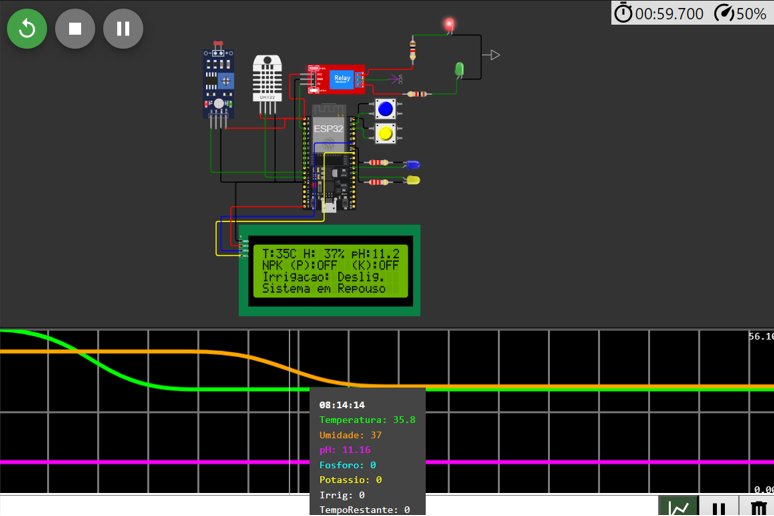
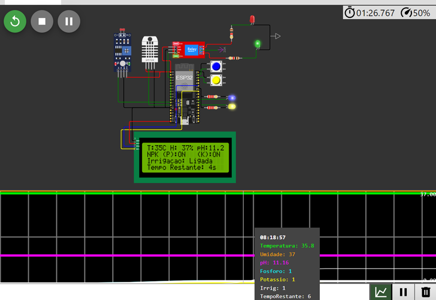
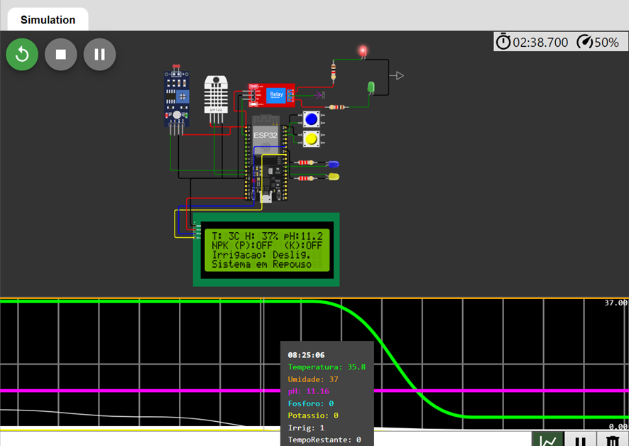

# FIAP - Faculdade de Informática e Administração Paulista

<p align="center">
<a href= "https://www.fiap.com.br/"></a>
</p>

<br>

## Construindo uma máquina agrícola

## 👨‍🎓 Integrantes do grupo

- RM559800 - [Jonas Felipe dos Santos Lima](https://www.linkedin.com/in/jonas-felipe-dos-santos-lima-b2346811b/)
- RM560173 - [Gabriel Ribeiro](https://www.linkedin.com/in/ribeirogab/)
- RM559926 - [Marcos Trazzini](https://www.linkedin.com/in/mstrazzini/)
- RM560461 - [Jose Antonio Correa Junior](https://www.linkedin.com/in/jacorrea/)
- RM559645 - [Edimilson Ribeiro](https://www.linkedin.com/in/edimilson-ribeiro/)

## 👩‍🏫 Professores

### Tutor(a)

- [Lucas Gomes Moreira](https://www.linkedin.com/in/lucas-gomes-moreira-15a8452a/)

### Coordenador(a)

- [André Godoi](https://www.linkedin.com/in/profandregodoi/)

---

## 📜 Descrição

Este projeto consiste na construção de uma máquina agrícola inteligente que utiliza sensores conectados a um microcontrolador ESP32 para monitorar e otimizar a irrigação de plantações. Ele combina sensoriamento, lógica de controle e integração com banco de dados para criar uma solução eficiente e sustentável para a gestão agrícola.

### Funcionalidades principais

- Monitoramento de umidade do solo, pH e níveis de nutrientes (simulados).
- Controle automatizado de uma bomba de irrigação com base nos dados dos sensores.
- Armazenamento dos dados coletados em um banco de dados SQL.
- Interface em Python para consulta e análise dos dados históricos.
- Dashboard em Python para visualização dos dados coletados.
- Integração com API meteorológica e análises em R.
- Treinamento de modelos de Machine Learning (Random Forest) para prever a necessidade de irrigação com base nos dados dos sensores.

### Demonstração no YouTube

[](https://youtu.be/cEPflbUoNao)

---

## 📁 Estrutura de pastas

- **`esp32`**: Contém o código e os recursos utilizados no microcontrolador ESP32:

  - `libraries.txt`: Lista de bibliotecas necessárias.
  - `diagram.json`: Diagrama do circuito configurado no **Wokwi**.
  - `sketch.ino`: Código principal em C/C++ para controle dos sensores e do relé.

- **`app`**: Código Python para interação com o banco de dados e visualização de dados:

  - `main.py`: Arquivo principal que executa a aplicação Streamlit.
  - `tabs/`: Diretório contendo as abas da interface do Streamlit.
    - `sensor_data.py`: Aba para exibir dados dos sensores.
    - `weather_info.py`: Aba para exibir informações meteorológicas.
    - `machine_learning.py`: Aba para exibir e treinar o modelo de Machine Learning (`sklearn`).
  - `utils/`: Funções utilitárias e módulos auxiliares.
    - `database.py`: Funções para interagir com o banco de dados SQLite.
    - `mqtt.py`: Quando executado, simula uma comunicação via MQTT.
    - `openweathermap.py`: Funções para obter dados meteorológicos da API OpenWeatherMap.
  - `.env`: Variáveis de ambiente para configuração segura (Copie o conteúdo do arquivo `.env.example` e cole em um novo arquivo chamado `.env`).

- **`database`**: Contém o script SQL de inicialização do banco:

  - `init.sql`: Script para criação automática da estrutura do banco de dados.
  - `data-model.png`: Imagem da modelagem do banco de dados.
  - `data-model.xml`: XML do SQL Designer (pode ser importado em <https://sql.toad.cz/>).

- **`analysis`**: Arquivos para análises em R:
  - `analysis.r`: Script principal para análises estatísticas.
  - `renv/`: Ambiente configurado para reprodutibilidade do código em R.

---

## 🔧 Como executar

### Configuração inicial

1. Clone este repositório:

   ```bash
   git clone git@github.com:FIAP-IA2024/farm-tech-solutions.git
   cd farm-tech-solutions
   ```

2. Crie e ative um ambiente virtual Python:

   - **Linux/macOS:**

     ```bash
     python3 -m venv venv
     source venv/bin/activate
     ```

   - **Windows:**

     ```cmd
     python -m venv venv
     venv\Scripts\activate
     ```

3. Instale as dependências Python:

   ```bash
   pip install -r requirements.txt
   ```

4. Inicie o banco de dados:
   O banco de dados será iniciado automaticamente na primeira execução do código Python.

---

### 🤖 Executar o ESP32 no Wokwi

1. Acesse o site [Wokwi](https://wokwi.com/).
2. Importe o diagrama do circuito:
   - Clique em **"Create New Project"** e selecione a opção **"Import Project"**.
   - Faça o upload do arquivo `diagram.json` disponível na pasta `esp32`.
3. Suba o código no ESP32:
   - No editor do Wokwi, copie e cole o conteúdo do arquivo `sketch.ino` disponível na pasta `esp32`.
4. Adicione as bibliotecas necessárias:
   - Certifique-se de adicionar as bibliotecas listadas no arquivo `libraries.txt`.
5. Execute o projeto:
   - Clique no botão **"Start Simulation"** para executar o ESP32 no ambiente virtual.
6. Monitore os dados:
   - Use o **Serial Monitor** do Wokwi para visualizar as leituras dos sensores e o status do sistema.

#### Projeto no Wokwi

Acesse o projeto diretamente no Wokwi clicando no link abaixo:

[🔗 Link Público Wokwi](https://wokwi.com/projects/416430516747031553)

#### SERIAL PLOTTER - Análise das variáveis

1. Primeira Alteração nos Parâmetros (pH, Temperatura e Umidade)
   Foram realizadas alterações nos seguintes parâmetros:

Temperatura: Ajustada para 35,8 °C, representada pela linha verde.
Umidade: Configurada para 37%, ilustrada pela linha laranja.
pH: Alterado para 11,16, representado pela linha roxa.
Até este ponto, não houve alterações nos sensores de fósforo (P) e potássio (K), e a irrigação ainda não foi ativada.


2. Alteração nos Sensores P e K e Início da Irrigação
   Com a ativação dos sensores P e K, simulados por botões e indicados pelos LEDs azul e amarelo, a irrigação foi iniciada.

No monitor plotter, isso é observado por:
Alterações sutis nas linhas brancas, azul e amarela, localizadas na parte inferior do gráfico.
Mudança no status da irrigação para "1" na tabela de índice.


3. Desativação Automática da Irrigação
   Após o tempo calculado com base nos parâmetros dos sensores, a irrigação foi desativada automaticamente.

No monitor plotter, a desativação é visível pelo decaimento das linhas brancas na parte inferior do gráfico, que representam
o estado da irrigação e o tempo restante.


---

### 📊 Executar o Dashboard

O dashboard é desenvolvido em **Streamlit**. Para executá-lo:

1. Execute o comando para iniciar o dashboard:

   ```bash
   streamlit run app/main.py
   ```

2. Acesse o dashboard no navegador em:

   ```txt
   http://localhost:8501
   ```

---

### 📈 Executar a Análise em R

A análise estatística está localizada no arquivo `analysis/analysis.r`. Para executá-la:

1. Certifique-se de ter o **R** e o ambiente configurado:

   - Utilize o arquivo `renv.lock` e a pasta `renv` para reprodutibilidade.

2. Navegue até o diretório `analysis`:

   ```bash
   cd analysis
   ```

3. Abra o arquivo `analysis.r` no RStudio ou execute-o no terminal:

   ```bash
   Rscript ./analysis.r
   ```

---

### Executando o MQTT

O arquivo **`mqtt.py`** simula a comunicação entre a aplicação Python e o microcontrolador. Ele publica eventos no **MQTT Broker** (usando o broker público `test.mosquitto.org`).

**Para executar:**

```bash
python apps/utils/mqtt.py
```

---

## 💻 Tecnologias utilizadas

- **Hardware:**

  - ESP32 (microcontrolador)
  - Sensores DHT22, LDR e botões para simulação de nutrientes.
  - **Wokwi**: Plataforma de simulação de hardware utilizada para configurar o circuito.

- **Software:**
  - Linguagem: Python, R, C/C++
  - Frameworks: Streamlit
  - Banco de dados: SQLite
  - API: OpenWeather
  - IDEs: Arduino IDE, RStudio

---

## 📋 Licença

Este projeto segue o modelo de licença da FIAP e está licenciado sob **Attribution 4.0 International**. Para mais informações, consulte o [MODELO GIT FIAP](https://github.com/agodoi/template).
