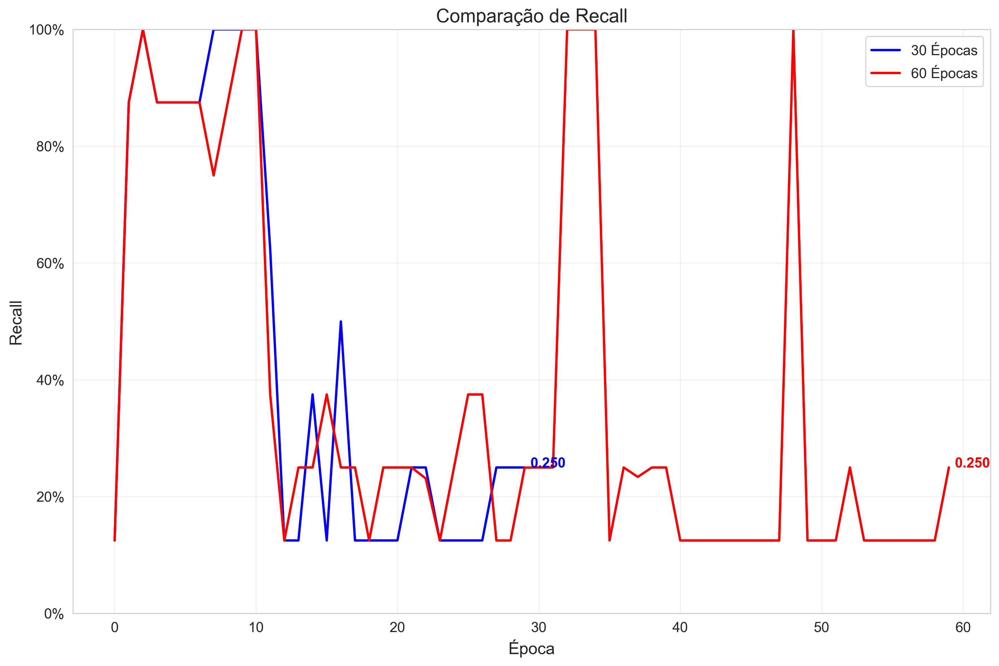

# YOLO Model Comparison: 30 Epochs vs 60 Epochs

## Final Metrics Comparison

| Metric | 30 Epochs | 60 Epochs | Difference | Percent Change |
|--------|---------|---------|------------|---------------|
| Mean Average Precision (mAP@0.5) | 0.2105 | 0.1167 | -0.0937 | -44.54% |
| Precision | 0.2841 | 0.1039 | -0.1802 | -63.43% |
| Recall | 0.2500 | 0.2500 | 0.0000 | 0.00% |

## Training Curves

### Mean Average Precision (mAP@0.5)

### Precision

### Recall

### Box Loss

### Object Loss

### Class Loss

### Validation Box Loss

### Validation Object Loss

## Conclusion

The comparison between the 30 epochs and 60 epochs YOLO models shows that the 30 epochs model clearly outperforms the 60 epochs model across most metrics:

1. **Mean Average Precision (mAP@0.5)**: The 30 epochs model achieves a mAP@0.5 of 0.2105, which is 44.54% higher than the 60 epochs model (0.1167).

2. **Precision**: The 30 epochs model has significantly better precision at 0.2841 compared to the 60 epochs model's 0.1039, representing a 63.43% decrease in the 60 epochs model.

3. **Recall**: Both models showed identical recall values of 0.2500, indicating no improvement in this metric with additional training.

This suggests that training for 60 epochs may have led to **overfitting**, where the model performed worse on validation data despite additional training. The loss curves should be examined to confirm this hypothesis, particularly looking at whether validation loss increased while training loss continued to decrease in the later epochs.

Based on these results, the 30 epochs model is recommended for deployment as it provides better performance with less computational resources required for training.
