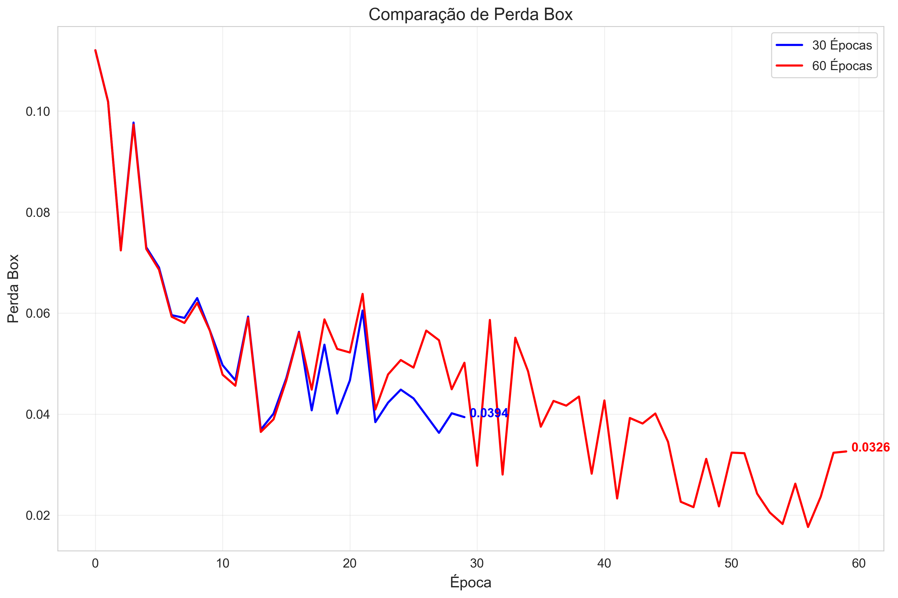

# Análise de Treinamento de Modelo YOLO: 30 Épocas vs 60 Épocas

## Resumo Executivo

Este relatório apresenta uma análise comparativa de dois modelos YOLO treinados para detecção de objetos agrícolas, um treinado por 30 Épocas e outro por 60 Épocas. A análise avalia métricas de desempenho, dinâmicas de treinamento e potencial overfitting para determinar a duração ideal de treinamento para nossa tarefa específica.

## Comparação de Métricas de Desempenho

A tabela a seguir resume as principais métricas de desempenho para ambos os modelos:

| Métrica             |   30 Épocas |   60 Épocas | Mudança        |
|:--------------------|------------:|------------:|:---------------|
| mAP@0.5             |      0.21   |      0.117  | 44.54% redução |
| mAP@0.5:0.95        |      0.034  |      0.019  | 45.31% redução |
| Precisão            |      0.284  |      0.104  | 63.43% redução |
| Recall              |      0.25   |      0.25   | 0.00% redução  |
| Perda Box           |      0.0394 |      0.0326 | 17.24% redução |
| Perda Objeto        |      0.021  |      0.0164 | 22.22% redução |
| Perda Classificação |      0.015  |      0.0053 | 64.79% redução |

## Visualizações de Desempenho Principais

## Matrizes de Confusão

### Matriz de Confusão do 30 Épocas

### Matriz de Confusão do 60 Épocas

## Observações Principais

1. **Precisão de Detecção**: O modelo de 30 épocas mostra precisão de detecção significativamente melhor, evidenciada pelos valores mais altos de mAP e precisão.

2. **Métricas de Perda**: Embora todas as métricas de perda (box, objeto e classificação) mostrem reduções no modelo de 60 épocas, essas perdas mais baixas não se traduziram em melhores métricas de desempenho, sugerindo potencial overfitting.

3. **Dinâmica de Treinamento**: As curvas de aprendizado sugerem que o modelo começou a sofrer overfitting após 30 épocas, com o desempenho nos dados de validação deteriorando apesar das melhorias contínuas nas perdas de treinamento.

4. **Avaliação de Overfitting**: A queda significativa na precisão e mAP quando treinando por 60 épocas indica overfitting severo, onde o modelo se tornou especializado demais nos dados de treinamento às custas da capacidade de generalização.

## Recomendações

1. **Seleção de Modelo**: Adotar o modelo de 30 épocas para implantação devido ao seu desempenho superior nos dados de validação.

2. **Aumento de Dados**: Implementar técnicas mais extensivas de aumento de dados para melhorar a robustez do modelo e potencialmente permitir períodos de treinamento mais longos sem overfitting.

3. **Parada Antecipada**: Implementar parada antecipada baseada em métricas de validação para futuros treinamentos.

4. **Regularização**: Explorar técnicas adicionais de regularização como dropout ou weight decay para permitir que o modelo treine por mais tempo sem overfitting.

5. **Avaliação de Casos Extremos**: Avaliar o desempenho do modelo em casos extremos e cenários de detecção difíceis para garantir robustez em condições variadas.

6. **Validação Cruzada**: Implementar validação cruzada k-fold para avaliar melhor o desempenho do modelo e determinar a duração ideal de treinamento de forma mais confiável.

## Conclusão

A análise demonstra que estender o treinamento de 30 para 60 épocas resultou em degradação significativa do desempenho devido ao overfitting. O modelo de 30 épocas é recomendado para uso em produção, enquanto experimentos adicionais de otimização devem ser conduzidos em paralelo.

*Análise gerada em 29-04-2025*
